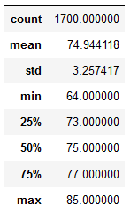
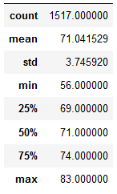

# surfs-up

## Overview of Project

### Purpose
The client, W. Avy, has asked for help analyzing weather data for Oahu in order to help convince an investor to take a chance on his ice cream business. The investor would reassurance that the business will be sustainable year round and that it won't get too cold for ice cream sales to happen.

## Results

### Differences in Weather between June and December
#### June Stats

#### December Stats


* There were almost 200 less temperature values collected for December than for June in the dataset. This sample size could be increased in the future to generate more reliable temperatures, but it still is a decent size to analyze.
* The average temperature for both June and December is only about 3 degrees apart, suggesting that the temperature stays pretty consistent year-round. 
* The minimum temperature recorded for December was 56, 8 degrees cooler than the minimum temperature recorded for June (64). As expected, December has cooler temperatures than June.

## Summary
While the temperatures in Oahu fluctuate throughout the year, the variation recorded is not enough to justify concerns that ice cream won't sell due to temperature. There is reasonable evidence to suggest that temperatures will remain optimal year-round for sales to occur. There will likely be some ebbs and flows of sales throughout the year, and temperature may play a small part in that, but it won't be the only factor W. Avy and his investors will need to consider.

The following are two additional queries that could be used to better analyze June and December weather impact by analyzing precipitation data.

* 
```
june_prec = session.query(Measurement.prcp).filter(extract('month', Measurement.date)==6).all()
june_prec =  list(np.ravel(june_prec))
june_prec_df = pd.DataFrame(june_prec)
june_prec_df.describe()
```
* 
```
dec_prec = session.query(Measurement.prcp).filter(extract('month', Measurement.date)==12).all()
dec_prec =  list(np.ravel(dec_prec))
dec_prec_df = pd.DataFrame(dec_prec)
dec_prec_df.describe()
```